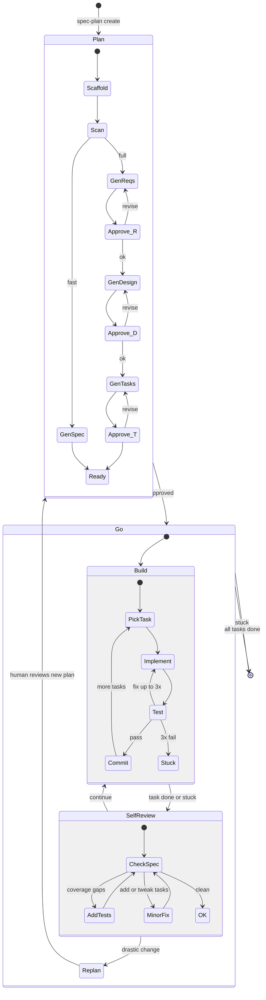

## Spec-Driven Development

Specs live in `.kiro/specs/<NN-name>/`. Numeric prefixes for ordering (`01-auth`, `02-api-layer`). Two modes:

- **Full ceremony** (requirements.md → design.md → tasks.md): formal traceability, approval gates, multi-team
- **Fast-track** (single `spec.md`): one scratchpad for planner/builder/reviewer — no gates, cycle freely between hats

**Detection:** `spec.md` → fast-track. `requirements.md` → full ceremony. Never mix both.
**Small work:** Add to an existing spec as tasks, or create a fast-track spec.
**Upgrade:** Fast-track → full when >20 tasks or traceability needed: Context → requirements.md, Decisions → design.md, Tasks → tasks.md.

### Spec Lifecycle

Every spec has a status. Write it in the first line of the top-level spec file
(`spec.md` or `requirements.md`) as `Status: <STATE>` (plus a `Since:` date).

| State | Meaning | Editable? |
|-------|---------|-----------|
| DRAFT | Being planned, not yet approved | Yes |
| ACTIVE | Approved, implementation in progress | Yes (scope adjustments flow through `/spec-plan refine`) |
| SHIPPED | All required tasks done; spec describes what was built | **Frozen.** Only forward-links to SUPERSEDED-BY or factual corrections |
| SUPERSEDED | Replaced by a newer spec; points forward to it | **Frozen.** Same rule |
| OBSOLETE | Feature removed; the spec is historical only | **Frozen.** Same rule |

**Freeze on ship.** Once a spec is SHIPPED, do not retroactively edit it to
match new reality. Retroactive edits destroy the record of why each decision
was made. New reality goes into a new spec and into the feature ledger.

**Successor pattern.** When a shipped feature needs rework, create a new spec
(`NN-name-v2` or `NN-different-name`). Mark the old spec `SUPERSEDED` and add
a `Superseded-by:` line pointing to the new spec. Update the feature ledger to
reflect the transition.

### Feature Ledger

A project-level living inventory of features across all specs, organized by
status. It is the source of truth for *what exists right now*; specs remain
the source of truth for *why each decision was made*.

**Location:** `.kiro/FEATURES.md` (sibling of `specs/` and `steering/`).
**Read first.** New agents should read this before any individual spec.
**Updated continuously.** Every time a task ships, deprecates, or removes a
feature, the corresponding ledger entry must be updated in the same session.

**Structure** is hierarchy-graphable so agents can later parse it into a
tree or DAG:

- H2 headers are domain paths: `## auth`, `## api/v2`, `## data/ingest`.
  Nested domains use slash notation in the header.
- H3 headers are feature ids (stable slugs): `### email-login`.
- A backticked status tag follows the feature id: `` `ACTIVE` ``.
- Metadata follows as bold-key bullets (graph-parseable).

**Template:**

```markdown
# Feature Ledger

Living inventory of features. Read this before any individual spec.
Each H2 is a domain (slash-nested), each H3 is a feature id with a status
tag; metadata bullets define graph edges.

**Status values:** DRAFT, PLANNED, IN-PROGRESS, BLOCKED, ACTIVE, DEPRECATED,
SUPERSEDED, OBSOLETE

Last drift sweep: [YYYY-MM-DD]

## auth

### email-login `ACTIVE`

- **spec**: 01-auth
- **since**: 2025-08-14
- **supersedes**: [password-auth]
- **depends-on**: [session-management]
- **description**: Email + password login with session cookies.

### magic-link `ACTIVE`

- **spec**: 01-auth
- **since**: 2025-10-03
- **description**: Passwordless one-time-link login via email.

### password-auth `SUPERSEDED`

- **spec**: 01-auth
- **since**: 2025-08-14
- **until**: 2026-01-20
- **superseded-by**: [email-login]
- **description**: Original password-only flow, replaced by email-login.

## api/v2

### bulk-export `IN-PROGRESS`

- **spec**: 05-bulk-export
- **target**: 2026-Q2
- **depends-on**: [session-management]
- **description**: CSV/JSON export endpoint for user data.
```

**Graph model** (for downstream tools):

- Domain hierarchy: from H2 path.
- Feature id: H3 header, unique per project.
- Parent feature (subfeatures): `**parent**: <id>` bullet.
- Spec edges: `**spec**: <spec-id>`.
- Supersession edges: `**supersedes**` / `**superseded-by**`.
- Dependency edges: `**depends-on**`.
- Lifecycle edges: derived from status transitions recorded in the ledger's
  `since` / `until` fields.

**Append, don't rewrite.** Status transitions edit the row in place; obsolete
and superseded entries stay in the ledger. Never delete feature history.

### Snapshots

A snapshot is a dated, frozen copy of the ledger + architectural summary
at a release or milestone boundary. Written once, never edited.

- **Location:** `.kiro/snapshots/YYYY-MM-NN-<label>.md`.
- **Contents:** date, labeled milestone, ledger state (copied), active specs
  list, architectural summary, any decisions since the last snapshot.
- **Cadence:** release boundary, quarter, or after a major drift sweep.

### Spec Resolution

SPEC → `.kiro/specs/*-SPEC/` or `.kiro/specs/SPEC/`. No name → auto-select if exactly one exists. Let **SPEC_DIR** = resolved directory. When creating, assign next available number.

### Core Loop



**Concurrency:** Single orchestrator owns spec files, one sequential builder by default. Subagents OK for non-code work (research, docs, website). Parallel builders only when user explicitly requests AND tasks are truly independent.

| State | Entry | Stops when |
|-------|-------|-----------|
| **Plan** | `/spec-plan create [--fast]` | User approves (full) or spec generated (fast) |
| **Go** | `/spec-go`, `/spec-task` | All done, needs human feedback, or stuck |
| **Review** | `/spec-audit`, `/spec-status`, `/spec-plan refine` | Findings presented |

**Resuming** — detect from files on disk:

| Files present | State | Action |
|---------------|-------|--------|
| None | Plan | `/spec-plan create` |
| `spec.md` | Go | Next unchecked task |
| `requirements.md` only | Plan | Generate design.md |
| `requirements.md` + `design.md` | Plan | Generate tasks.md |
| All 3 + `[ ]` tasks | Go | Next task |
| All tasks `[x]` | Done | Audit or merge |

### Rules

1. **Read before acting** — feature ledger (`.kiro/FEATURES.md`) first, then all spec files + steering docs if they exist.
2. **Re-anchor when uncertain** — re-read spec if next action could deviate.
3. **Respect dependencies** — never skip ahead.
4. **Tests are separate tasks.**
5. **Commit per task** — `feat(<spec>/<task>): [description]`
6. **Minimal changes** — only what the task requires.
7. **Respect spec lifecycle** — never edit a SHIPPED / SUPERSEDED / OBSOLETE spec except for forward links or factual fixes. Create a successor spec instead.
8. **Update the ledger on ship** — every feature transition (added, shipped, deprecated, removed) is reflected in `.kiro/FEATURES.md` in the same session.

---

## Commands

### `/spec-plan <name> [create|refine] [--fast]`

Auto-detected: **create** if spec doesn't exist, **refine** if it does.

#### Create (full ceremony)

**Scaffold:** Create `.kiro/specs/NN-SPEC/`.
**Scan:** Read README, manifests, source structure, tests, CI, steering docs. Align with conventions.

**Generate requirements.md** — template below. **Generate first, iterate second.** EARS format:
- `WHEN [event] THEN [system] SHALL [response]`
- `IF [condition] THEN [system] SHALL [response]`
- `WHILE [state] [system] SHALL [response]`
- `[system] SHALL [response]`

Write the file, then ask: *"Please review requirements.md. Ready for design?"*

**Generate design.md** — template below. Research if needed. Modules, interfaces, data flow, testing strategy, correctness properties validating requirements. Write the file, then ask: *"Please review design.md. Ready for tasks?"*

**Generate tasks.md** — template below. Each task one session. Depends/Requirements/Properties. Order: Foundation → Core → Tests → Polish. Every requirement → ≥1 task. Write the file, then ask: *"Please review tasks.md. Ready to implement?"*

// turbo
**Commit:** `git add -A && git commit -m "spec(SPEC): create requirements, design, and tasks"`

#### Create (fast-track)

Same scaffold and scan. Generate `spec.md` (template below): Context, Decisions (can start empty), Tasks by P1/P2/P3. Iterate if feedback, then move on.

// turbo
Commit: `git add -A && git commit -m "spec(SPEC): create fast-track spec"`

#### Refine (full ceremony)

1. Read requirements.md, design.md, tasks.md + scan repo for drift.
2. Ask what should change (or use `/spec-audit` findings).
3. Refinement: merge redundant requirements, separate what from how, collapse over-specified sub-requirements, merge overlapping properties, cascade renumbering, validate traceability (requirement → property → task), align spec with disk.
4. Trace changes top-down and bottom-up. Done tasks (`[x]`): update references, do NOT uncheck.
5. Ask: *"Please review the updated spec files. Approve refinement?"*

// turbo
Commit: `git add -A && git commit -m "spec(SPEC): refine — [brief]"`

#### Refine (fast-track)

Read `spec.md`, scan for drift, update Context/Decisions/Tasks, re-prioritize. If >20 tasks, suggest promoting to full ceremony. Append to Log.

// turbo
Commit: `git add -A && git commit -m "spec(SPEC): refine fast-track — [brief]"`

---

### `/spec-go <name> [count]`

Also triggered by: "run the spec", "implement the spec", "loop the spec", "build the spec".

**This is a loop — do NOT stop after one task.** Keep cycling build→self-review→build until: all tasks done, human feedback needed, or stuck on repeated failures. Optional count limits tasks per session.

**Build phase:**
1. **Read spec** — full: requirements.md, design.md, tasks.md (+ steering). Fast-track: spec.md. Also read `.kiro/FEATURES.md` if present.
2. **Pick next task** — first `[ ]` with all deps satisfied. Only optional left → STOP.
3. **Announce** — "Starting task [ID]: [TITLE]"
4. **Implement** — read relevant code first. Test tasks: Red-Green-Refactor. Implementation tasks: write code, run existing tests.
5. **Test** — failures → fix up to 3x. Still failing → mark `[!] BLOCKED: reason`, skip to next. No unblocked tasks → STOP (stuck).
// turbo
6. **Lint** if configured.
7. **Update** — mark task `[x]`.
8. **Update the feature ledger** — if the task ships, deprecates, supersedes, or removes a feature, update the corresponding entry in `.kiro/FEATURES.md`. Add new features as `IN-PROGRESS` → `ACTIVE` when fully shipped. Never delete prior entries; mark them SUPERSEDED / OBSOLETE with a forward link.
// turbo
9. **Commit** — `git add -A && git commit -m "feat(SPEC/[ID]): [description]"`

**Self-review phase** (every 3 tasks or after a BLOCKED):
10. Re-read spec, check for drift. **Primary job: ensure test coverage** — for each completed task, verify a test task exists that covers it. If not, append a test task so the builder implements and runs it next. Tests must pass before the reviewer signs off.
11. **Ledger consistency check** — features marked ACTIVE in `.kiro/FEATURES.md` must correspond to shipped tasks; features marked IN-PROGRESS must have an open task. Fix inconsistencies inline.
12. **Minor fixes** (add/drop/tweak tasks, add test tasks) → apply inline, continue. **Drastic changes** (wrong requirements, architecture rethink, scope shift) → STOP, go to Plan for human review.
13. **Report checkpoint:**
```
Checkpoint: SPEC — N/TOTAL tasks done
  Completed this session:
    [x] 1.1: [title]
    [x] 1.2: [title]
  Blocked:
    [!] 2.1: [reason]
  Tests: PASS/FAIL
  Next: [ID]: [title]
  Spec drift: [none / what was fixed]
```
**DO NOT STOP HERE.** Go back to Build phase step 2 and pick the next task. Only stop when: all tasks `[x]`, a task needs human input, or stuck on repeated failures.

---

### `/spec-task <name> <task>`

Single task build. Same as `/spec-go` build steps 1–9 for one task. Verify deps first — if unmet, STOP. When run by a subagent in a parallel worktree, **never modify spec files or the feature ledger** — only write code, tests, docs. Orchestrator updates status and ledger after merge.

**→ Report:**
```
Task [ID] complete: [title]
  Tests: PASS/FAIL
  Files changed: [list]
  Follow-up: [issues or "none"]
```

---

### `/spec-audit <name>`

Read requirements.md, design.md, tasks.md, and the feature ledger. Run checks:
1. **Traceability** — orphan requirements, orphan properties, broken references
2. **Redundancy** — duplicates, subset properties, implementation details in requirements
3. **Stale language** — future tense on done tasks, checked goals with unchecked subs
4. **Spec↔disk drift** — design directory vs actual repo
5. **Doc sync** — README/docs vs spec
6. **Ledger sync** — features referenced in this spec must appear in the ledger with consistent status; shipped tasks must correspond to ACTIVE ledger entries

**→ Print report:**
```
Audit: SPEC
  Traceability:
    ✓ N requirements → M properties → K tasks
    ⚠ R[N] has no validating property
    ⚠ P[N] has no implementing task
  Redundancy:
    ⚠ R[N] and R[M] describe same behavior
  Stale language:
    ⚠ R[N] future tense but task [ID] done
  Spec↔disk drift:
    ✗ spec lists "[path]" — not on disk
  Doc sync:
    ⚠ README says "[X]" but spec says "[Y]"
  Summary: E errors, W warnings
```
Suggest `/spec-plan SPEC refine`.

---

### `/spec-status`

Discover all specs in `.kiro/specs/`. Read tasks, count status marks, compute completion. Also read each spec's `Status:` lifecycle line and report it.

**→ Print dashboard:**
```
SPEC STATUS
  01-auth [SHIPPED]:
    Progress: ███████████ 7/7 (100%)
    Status:   1.1✓ 1.2✓ 1.3✓ 2.1✓ 2.2✓ 3.1✓ 3.2✓
    Blocked:  none
  02-api-layer [ACTIVE]:
    Progress: ██░░░░░░░░ 1/5 (20%)
    Status:   1.1✓ 1.2○ 2.1○ 2.2○ 3.1○*
    Blocked:  none
  03-legacy-export [SUPERSEDED → 05-bulk-export]:
    Progress: ███████ 3/5 (historical)
```

### `/spec-ledger [audit | add <feature> <spec> | update <feature> <status> | drift-sweep]`

Manage the project feature ledger at `.kiro/FEATURES.md`.

- **No args:** print the ledger grouped by status.
- **`audit`:** check every feature entry against code and specs. Flag:
  - ghost features (ACTIVE in ledger but not in code)
  - orphan features (in code but missing from ledger)
  - lifecycle mismatches (SHIPPED spec with non-ACTIVE feature)
  - broken supersession chains (superseded-by points to missing id)
- **`add <feature-id> <spec-id>`:** append a new feature entry as `PLANNED`
  or `IN-PROGRESS` (depending on task state), under the appropriate domain H2.
- **`update <feature-id> <STATUS>`:** transition a feature. Sets `until:` for
  DEPRECATED / SUPERSEDED / OBSOLETE; prompts for `superseded-by:` if needed.
- **`drift-sweep`:** run `audit`, resolve non-ambiguous entries automatically,
  report the ambiguous ones, then stamp `Last drift sweep: <date>` in the
  ledger header.

Never delete prior entries. Status transitions edit in place; superseded and
obsolete entries remain as historical record.

// turbo
Commit: `git add .kiro/FEATURES.md && git commit -m "feat(ledger): <change summary>"`

### `/spec-snapshot [<label>]`

Freeze a dated copy of the feature ledger + architecture summary at
`.kiro/snapshots/YYYY-MM-NN[-label].md`.

1. Run `/spec-ledger audit` first and resolve non-ambiguous drift.
2. Copy the current ledger into the snapshot.
3. Add an architecture summary: active specs list (with status), core module
   layout, key decisions since the previous snapshot.
4. Stamp the snapshot date and label (e.g., `2026-04-17-q2-release`).
5. Update the ledger's `Last drift sweep:` line to the snapshot date.

Snapshots are write-once. Never edit a prior snapshot.

// turbo
Commit: `git add .kiro/snapshots/ .kiro/FEATURES.md && git commit -m "snapshot(<label>): freeze state"`

### `/spec-merge <name>`

// turbo
Find branches (`git branch --list "task/*"`, `git worktree list`), ask which to merge. Merge each (`git merge <branch> --no-edit`), resolve conflicts intelligently. Clean up branches/worktrees (confirm). Verify tasks status, tests, lint. Commit fixes: `git add -A && git commit -m "chore(SPEC): post-merge fixes"`

### `/spec-reset <name>`

Confirm with user. Reset all status marks (`[x]`/`[~]`/`[!]` → `[ ]`, preserve `*`).
// turbo
Commit: `git add -A && git commit -m "chore(SPEC): reset progress"`

### `/spec-help`

Print the Core Loop diagram and command table from this skill, then ask what the user wants to do.

---

## Templates

### requirements.md

```markdown
# Requirements Document

Status: DRAFT
Since: [YYYY-MM-DD]
Features: [feature-id, feature-id]
<!-- Status values: DRAFT, ACTIVE, SHIPPED, SUPERSEDED, OBSOLETE -->
<!-- Once SHIPPED, this file is frozen except for forward links or factual fixes. -->

## Introduction
<!-- What this spec covers and why -->

## Glossary
- **Term_1**: Definition

## Requirements

### Requirement 1: [Feature area]
**User Story:** As a [role], I want [action], so that [benefit].
#### Acceptance Criteria
1. WHEN [trigger], THE [Component] SHALL [expected behavior]
2. WHEN [trigger], THE [Component] SHALL [expected behavior]

### Requirement 2: [Feature area]
**User Story:** As a [role], I want [action], so that [benefit].
#### Acceptance Criteria
1. WHEN [trigger], THE [Component] SHALL [expected behavior]

### Non-Functional
**NF 1**: [Performance / reliability / security requirement]

## Out of Scope
<!-- What this spec explicitly does NOT cover -->
```

### design.md

```markdown
# Design: [SPEC NAME]

## Tech Stack
- **Language**:
- **Framework**:
- **Testing**:
- **Linter**:

## Directory Structure
\```
src/
tests/
\```

## Architecture Overview
\```mermaid
graph TD
    A[Module A] --> B[Module B]
    A --> C[Module C]
    B --> D[Shared Service]
    C --> D
\```

## Module Design
### [Module 1]
- **Purpose**: [what it does]
- **Interface**:
  \```
  [function signatures, class interfaces, API endpoints]
  \```
- **Dependencies**: [what it depends on]

## Data Flow
\```mermaid
sequenceDiagram
    participant User
    participant CLI
    participant Service
    participant Store
    User->>CLI: command
    CLI->>Service: process(args)
    Service->>Store: read/write
    Store-->>Service: result
    Service-->>CLI: output
    CLI-->>User: display
\```

## State Management
<!-- Omit if stateless -->

## Data Models
<!-- Omit if simple -->

## Error Handling Strategy

## Testing Strategy
- **Property tests**: Verify design invariants (required)
- **E2E tests**: Validate user stories end-to-end (required)
- **Unit tests**: Complex internal logic only (optional)
- **Test command**: `[command]`
- **Lint command**: `[command]`

## Constraints

## Correctness Properties
### Property 1: [Property name]
- **Statement**: *For any* [condition], when [action], then [expected outcome]
- **Validates**: Requirement 1.1, 1.2
- **Example**: [concrete example]
- **Test approach**: [how to verify]

## Edge Cases

## Decisions
### Decision: [Title]
**Context:** [Situation]
**Options:** 1. [Option] — Pros / Cons  2. [Option] — Pros / Cons
**Decision:** [Chosen]  **Rationale:** [Why]

## Security Considerations
<!-- If applicable -->
```

**Diagram guidance**: Always include component diagram. Add sequence (multi-actor), state (stateful), ER (data-heavy). Omit empty sections.

### tasks.md

```markdown
# Tasks: [SPEC NAME]

## Status marks
<!-- [ ] pending | [x] done | [~] skipped | [!] BLOCKED: reason | [ ]* optional -->

## Tasks

- [x] 1. Setup phase
  - [x] 1.1 [Completed task title]
    - [What was implemented]
    - **Depends**: —
    - **Requirements**: 1.1, 1.2
    - **Properties**: 1
  - [x] 1.2 [Completed task title]
    - **Depends**: 1.1

- [ ] 2. Core phase
  - [!] 2.1 [Blocked task] BLOCKED: [reason]
    - **Depends**: 1.1
    - **Requirements**: 2.1
    - **Properties**: 2
  - [ ] 2.2 [Pending task]
    - **Depends**: 1.1, 1.2
  - [ ] 2.3 Write property test for [property name]
    - **Depends**: 2.2
    - **Properties**: 2
  - [ ]* 2.4 [Optional task]
    - **Depends**: 2.2

- [ ] 3. E2E Tests
  - [ ] 3.1 E2E — [User story scenario]
    - **Depends**: 2.2, 2.3
    - **Requirements**: 1.1, 2.1

## Notes
```

**Conventions**: Hierarchical IDs. Parents = phase headers (checked when all children done). **Depends** required; **Requirements**/**Properties** for traceability. Tests = separate sub-tasks. Each task 30 min – 2 hours.

### spec.md (fast-track)

This is the single working scratchpad for all three hats: **planner** (Context + Constraints + Tasks), **builder** (check off tasks + append Log), **reviewer** (Decisions + flag issues + add test tasks in Log). No gates — cycle freely between hats throughout the work.

```markdown
# [SPEC NAME]

Status: DRAFT
Since: [YYYY-MM-DD]
Features: [feature-id, feature-id]
<!-- Status values: DRAFT, ACTIVE, SHIPPED, SUPERSEDED, OBSOLETE -->
<!-- Once SHIPPED, this file is frozen except for forward links or factual fixes. -->

## Context
<!-- Why this work exists, who it's for, what success looks like. -->

[2-3 sentences describing the problem and motivation]

## Constraints
<!-- Non-negotiable boundaries: tech stack, perf, compatibility, timeline. -->

- [e.g., Must use existing auth system]
- [e.g., Python 3.11+, no new dependencies]

## Decisions
<!-- Key choices made. Add as you go — capture the fork, the choice, and why. -->

### D1: [Decision title]
**Choice:** [what was decided]
**Why:** [rationale — what was the alternative, why not that]

### D2: [Decision title]
**Choice:** [what was decided]
**Why:** [rationale]

## Tasks
<!-- [ ] pending | [x] done | [~] skipped | [!] BLOCKED: reason -->

### P1 — Must Do
- [x] 1.1 [Completed task]
- [ ] 1.2 [Pending task]
- [ ] 1.3 Test: [what to verify for 1.1-1.2]

### P2 — Should Do
- [ ] 2.1 [Task description]

### P3 — Nice to Have
- [ ] 3.1 [Task description]

## Open Questions
<!-- Unknowns that need research or user input before proceeding. -->

- [ ] [Question — what needs answering, who can answer it]
- [x] [Resolved question — answer found, see D2]

## Log
<!-- Append as you go. Date + what happened + decisions made + issues found. -->

**[YYYY-MM-DD]** — [what was done, what was learned, what changed]
**[YYYY-MM-DD]** — [reviewer hat: added test task 1.3, found gap in X]
```

**Conventions**: IDs = `<priority>.<sequence>`. No Depends/Requirements metadata — keep lightweight. Status marks same as full ceremony. The Log is where the reviewer hat lives — flag drift, record why tasks were added/dropped, note test coverage gaps. Open Questions track unknowns that block or inform tasks.

---

## Steering Docs (optional)

Read-only project context at `.kiro/steering/` (root, not inside `specs/`):
`product.md` (vision), `structure.md` (repo layout), `tech.md` (stack decisions).
Read during planning and before implementing. Never modify during execution.

## Analytic Specs

When analytic/notebook/experiment-oriented, pair with `analytic-workbench`. Requirements should cover artifact outputs, review checkpoints, promotion criteria. Design should make notebook vs module boundaries explicit. Tasks should separate exploratory → review → promotion stages.
