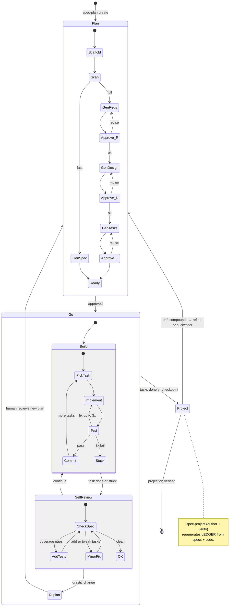

## Spec-Driven Development

Specs live under `<SPECS_ROOT>/<NN-name>/`. Numeric prefixes for ordering
(`01-auth`, `02-api-layer`). Two modes:

- **Full ceremony** (requirements.md → design.md → tasks.md): formal traceability, approval gates, multi-team
- **Fast-track** (single `spec.md`): one scratchpad for planner/builder/reviewer — no gates, cycle freely between hats

**Detection:** `spec.md` → fast-track. `requirements.md` → full ceremony. Never mix both.
**Small work:** Add to an existing spec as tasks, or create a fast-track spec.
**Upgrade:** Fast-track → full when >20 tasks or traceability needed: Context → requirements.md, Decisions → design.md, Tasks → tasks.md.

### SPECS_ROOT resolution

Different projects use different conventions. Resolve once at entry, never
hard-code a path.

Resolution order (first match wins):

1. `specs_root:` line in `CLAUDE.md` or `AGENTS.md` at the repo root.
2. `.kiro/specs/` if it exists.
3. `specs/` at the repo root if it exists.
4. Brand-new project with neither: default to `.kiro/specs/`.

Sibling artifacts live alongside the chosen specs directory:

| Specs root           | Ledger                   | Steering docs        |
|----------------------|--------------------------|----------------------|
| `.kiro/specs/`       | `.kiro/FEATURES.md`      | `.kiro/steering/`    |
| `specs/` (repo root) | `FEATURES.md` (repo root)| `steering/` (repo root)|

Throughout this skill, **SPECS_ROOT** is the resolved specs directory and
**LEDGER** is the resolved `FEATURES.md` path. Commands resolve these once
per invocation.

### Frontmatter schema

Every top-level spec file (`spec.md` or `requirements.md`) starts with a YAML
frontmatter block. The frontmatter is the **uncontroversial factual truth**
that the projection and all tooling read from.

```yaml
---
spec_id: 01-auth              # directory-matching id
status: ACTIVE                # DRAFT | ACTIVE | SHIPPED | SUPERSEDED | OBSOLETE
since: 2025-08-14             # when status entered current value
until: null                   # set only on SUPERSEDED/OBSOLETE
epic: auth                    # domain H2 in FEATURES.md (slash-nested: "api/v2")
features: [email-login, magic-link]
supersedes: []                # spec_ids this spec replaces
superseded_by: null           # spec_id that replaces this one
depends_on: []                # spec_ids whose outputs this spec requires
---
```

Rules:

- `spec_id` must match the directory name.
- `status` values follow the lifecycle state machine below.
- `superseded_by` on a SUPERSEDED spec must reference a spec whose
  `supersedes` list includes this `spec_id` (bidirectional integrity).
- `features` must be unique project-wide (the feature id is stable across
  specs).
- `depends_on` entries must reference real `spec_id`s.

See `references/frontmatter-schema.md` for the complete schema, examples,
and the `spec_lint` validation rules.

### Spec Lifecycle

Every spec has a status. It is the `status:` field in the frontmatter block.

| State | Meaning | Editable? |
|-------|---------|-----------|
| DRAFT | Being planned, not yet approved | Yes |
| ACTIVE | Approved, implementation in progress | Yes (scope adjustments flow through `/spec-plan refine`) |
| SHIPPED | All required tasks done; spec describes what was built | **Frozen.** Only forward-links to SUPERSEDED-BY or factual corrections |
| SUPERSEDED | Replaced by a newer spec; points forward to it | **Frozen.** Same rule |
| OBSOLETE | Feature removed; the spec is historical only | **Frozen.** Same rule |

**Freeze on ship.** Once a spec is SHIPPED, do not retroactively edit it to
match new reality. Retroactive edits destroy the record of why each decision
was made. New reality goes into a new spec and into the projection.

**Successor pattern.** When a shipped feature needs rework, create a new spec
(`NN-name-v2` or `NN-different-name`). Mark the old spec `SUPERSEDED`, set
`superseded_by:` to the new spec_id, and set the new spec's `supersedes:`
list to include the old spec_id. The projection reads both fields and emits
the transition row in the ledger.

### The Feature Projection (was: Feature Ledger)

`LEDGER` (`FEATURES.md`) is a **derived projection** of the feature state
across all specs, grounded in actual code. It is not hand-maintained. It is
rewritten in place every time `/spec-project` runs.

The file has two layers:

1. **Facts block** — machine-stamped from `scripts/spec_facts.py`. Feature
   id, owning spec, status, since/until, supersession edges, dependency
   edges. The facts block cannot be wrong because it is regenerated from
   frontmatter and task state on every projection, and `--check` mode
   fails CI if the on-disk block diverges from reality.
2. **Narrative block** — AI-authored during `/spec-project`, grounded in
   code reading, with required evidence anchors on every claim. Covers
   drift flags, recent transitions, friction points, open questions — the
   content a mechanical projection cannot produce.

**Location:** `LEDGER` (sibling of SPECS_ROOT).
**Read first.** New agents read `LEDGER` before any individual spec.
**Do not hand-edit.** All changes go through `/spec-project`. The header
warns readers: `<!-- AUTO-GENERATED by /spec-project. Do not edit. -->`

**Graph model** (for downstream tools):

- Domain hierarchy: `epic:` field in frontmatter, slash-nested.
- Feature id: entry in `features:` list, unique per project.
- Spec edges: derived from frontmatter (which spec owns which feature).
- Supersession edges: `supersedes:` / `superseded_by:` fields.
- Dependency edges: `depends_on:` field.
- Lifecycle edges: derived from `status:` / `since:` / `until:` transitions
  (git history on LEDGER provides the sequence).

**No separate snapshots.** A spec that is no longer current — SHIPPED,
SUPERSEDED, or OBSOLETE — is itself a dated record of what was built and
why. Combined with `since:` / `until:` fields and git history on LEDGER,
any point-in-time state is reconstructible without a snapshot artifact.

### Spec Resolution

SPEC → `SPECS_ROOT/*-SPEC/` or `SPECS_ROOT/SPEC/`. No name → auto-select if
exactly one exists. Let **SPEC_DIR** = resolved directory. When creating,
assign next available number under SPECS_ROOT.

### Core Loop



**Concurrency:** Single orchestrator owns spec files, one sequential builder
by default. Subagents OK for non-code work (research, docs, website). Parallel
builders only when user explicitly requests AND tasks are truly independent.

| State | Entry | Stops when |
|-------|-------|-----------|
| **Plan** | `/spec-plan create [--fast]` | User approves (full) or spec generated (fast) |
| **Go** | `/spec-go`, `/spec-task` | All done, needs human feedback, or stuck |
| **Review** | `/spec-audit`, `/spec-status`, `/spec-plan refine` | Findings presented |
| **Project** | `/spec-project` | LEDGER rewritten and verifier passed |

**Resuming** — detect from files on disk:

| Files present | State | Action |
|---------------|-------|--------|
| None | Plan | `/spec-plan create` |
| `spec.md` | Go | Next unchecked task |
| `requirements.md` only | Plan | Generate design.md |
| `requirements.md` + `design.md` | Plan | Generate tasks.md |
| All 3 + `[ ]` tasks | Go | Next task |
| All tasks `[x]` | Project / Done | `/spec-project` then audit or merge |

### Rules

1. **Read before acting** — LEDGER first, then all spec files + steering docs if they exist.
2. **Re-anchor when uncertain** — re-read spec if next action could deviate.
3. **Respect dependencies** — never skip ahead.
4. **Tests are separate tasks.**
5. **Commit per task** — `feat(<spec>/<task>): [description]`
6. **Minimal changes** — only what the task requires.
7. **Respect spec lifecycle** — never edit a SHIPPED / SUPERSEDED / OBSOLETE spec except for forward links or factual fixes. Create a successor spec instead.
8. **LEDGER is derived** — never hand-edit `FEATURES.md`. Run `/spec-project` after any task that ships/deprecates/supersedes a feature, after frontmatter changes, or when the human asks for fresh state.
9. **Every projection claim cites an anchor.** Valid anchors: `[spec:NN-name]`, `[task:NN-name#ID]`, `[commit:<short-sha>]`, `[src:path/to/file:Lxx]`. ACTIVE and SHIPPED claims **require** at least one `[src:]` anchor.
10. **Code-grounding on projection.** `/spec-project` reads actual code for every feature asserted as ACTIVE/SHIPPED. Paper truth (spec + task anchors alone) is insufficient. See `references/spec-code-grounding.md`.
11. **Escalate on compound drift.** When `/spec-audit` repeats drift findings, or when multiple features land in Drift flags across consecutive projections, escalate to the full 4-pass audit in `skills/workflow-guardrails/refs/ai-code-review.md`.
12. **This skill's formality is not discovery.** Frontmatter lint, projection-diff, and the other mechanical consistency checks are CI gates — they fail when YOU just made the graph inconsistent, and they silently pass when the repo is healthy. Do not loop on them as a "what to do next" mechanism. When a task says "actively discover work," read DK comments on the ledger, failing tests, user's git state, deferred milestones, and doubt-flagged SHIPPED features. Reserve the mechanical tooling for its narrow purpose: pre-commit / CI, and right after a `/spec-project` regen to confirm the regen was clean.
13. **Docs are grounded too.** `/spec-docs` applies the same evidence-anchor discipline as `/spec-project`. Claims without anchors are flagged, not rewritten. Sections wrapped in `<!-- managed-by: spec-docs -->` ... `<!-- /managed-by -->` are regenerated fully; everything else gets targeted factual corrections only. Always run `/spec-project` before `/spec-docs` so LEDGER is fresh.

---

## Commands

### `/spec-plan <name> [create|refine] [--fast]`

Auto-detected: **create** if spec doesn't exist, **refine** if it does.

#### Create (full ceremony)

**Scaffold:** Create `SPECS_ROOT/NN-SPEC/`. Seed YAML frontmatter:
`spec_id`, `status: DRAFT`, `since:` today, `epic`, `features: []`, empty
`supersedes`/`superseded_by`/`depends_on`.

**Scan:** Read README, manifests, source structure, tests, CI, steering docs. Align with conventions.

**Generate requirements.md** — template below. **Generate first, iterate second.** EARS format:
- `WHEN [event] THEN [system] SHALL [response]`
- `IF [condition] THEN [system] SHALL [response]`
- `WHILE [state] [system] SHALL [response]`
- `[system] SHALL [response]`

Write the file, then ask: *"Please review requirements.md. Ready for design?"*

**Generate design.md** — template below. Research if needed. Modules, interfaces, data flow, testing strategy, correctness properties validating requirements. Write the file, then ask: *"Please review design.md. Ready for tasks?"*

**Generate tasks.md** — template below. Each task one session. Depends/Requirements/Properties. Order: Foundation → Core → Tests → Polish. Every requirement → ≥1 task. Write the file, then ask: *"Please review tasks.md. Ready to implement?"*

// turbo
**Commit:** `git add -A && git commit -m "spec(SPEC): create requirements, design, and tasks"`

#### Create (fast-track)

Same scaffold and scan. Generate `spec.md` (template below) with YAML
frontmatter, then Context, Decisions (can start empty), Tasks by P1/P2/P3.
Iterate if feedback, then move on.

// turbo
Commit: `git add -A && git commit -m "spec(SPEC): create fast-track spec"`

#### Refine (full ceremony)

1. Read requirements.md, design.md, tasks.md + scan repo for drift.
2. Ask what should change (or use `/spec-audit` findings).
3. Refinement: merge redundant requirements, separate what from how, collapse over-specified sub-requirements, merge overlapping properties, cascade renumbering, validate traceability (requirement → property → task), align spec with disk.
4. Trace changes top-down and bottom-up. Done tasks (`[x]`): update references, do NOT uncheck.
5. Ask: *"Please review the updated spec files. Approve refinement?"*

// turbo
Commit: `git add -A && git commit -m "spec(SPEC): refine — [brief]"`

#### Refine (fast-track)

Read `spec.md`, scan for drift, update Context/Decisions/Tasks, re-prioritize. If >20 tasks, suggest promoting to full ceremony. Append to Log.

// turbo
Commit: `git add -A && git commit -m "spec(SPEC): refine fast-track — [brief]"`

---

### `/spec-go <name> [count]`

Also triggered by: "run the spec", "implement the spec", "loop the spec", "build the spec".

**This is a loop — do NOT stop after one task.** Keep cycling build→self-review→build until: all tasks done, human feedback needed, or stuck on repeated failures. Optional count limits tasks per session.

**Build phase:**
1. **Read spec** — full: requirements.md, design.md, tasks.md (+ steering). Fast-track: spec.md. Also read LEDGER if present.
2. **Pick next task** — first `[ ]` with all deps satisfied. Only optional left → STOP.
3. **Announce** — "Starting task [ID]: [TITLE]"
4. **Implement** — read relevant code first. Test tasks: Red-Green-Refactor. Implementation tasks: write code, run existing tests.
5. **Test** — failures → fix up to 3x. Still failing → mark `[!] BLOCKED: reason`, skip to next. No unblocked tasks → STOP (stuck).
// turbo
6. **Lint** if configured.
7. **Update** — mark task `[x]`.
// turbo
8. **Commit** — `git add -A && git commit -m "feat(SPEC/[ID]): [description]"`

**Self-review phase** (every 3 tasks or after a BLOCKED):
9. Re-read spec, check for drift. **Primary job: ensure test coverage** — for each completed task, verify a test task exists that covers it. If not, append a test task so the builder implements and runs it next. Tests must pass before the reviewer signs off.
10. **Minor fixes** (add/drop/tweak tasks, add test tasks) → apply inline, continue. **Drastic changes** (wrong requirements, architecture rethink, scope shift) → STOP, go to Plan for human review.
11. **Report checkpoint:**
```
Checkpoint: SPEC — N/TOTAL tasks done
  Completed this session:
    [x] 1.1: [title]
    [x] 1.2: [title]
  Blocked:
    [!] 2.1: [reason]
  Tests: PASS/FAIL
  Next: [ID]: [title]
  Spec drift: [none / what was fixed]
```
**DO NOT STOP HERE.** Go back to Build phase step 2 and pick the next task. Only stop when: all tasks `[x]`, a task needs human input, or stuck on repeated failures.

**On session exit** (all tasks done OR stuck OR checkpoint before handoff):
12. Run `/spec-project` to regenerate LEDGER. This is non-optional — the
    projection is how shipped work becomes visible to the next session.
13. After a spec ships, do not idle. Immediately check for doubt-flagged
    features in LEDGER, skipped tests, and known gaps in the just-shipped spec
    before stopping or scheduling a long wait. Apply the `workflow-guardrails`
    skill Rule 12 discovery order to find the next concrete work item.

---

### `/spec-task <name> <task>`

Single task build. Same as `/spec-go` build steps 1–8 for one task. Verify deps first — if unmet, STOP. When run by a subagent in a parallel worktree, **never modify spec files or LEDGER** — only write code, tests, docs. Orchestrator updates status and runs `/spec-project` after merge.

**→ Report:**
```
Task [ID] complete: [title]
  Tests: PASS/FAIL
  Files changed: [list]
  Follow-up: [issues or "none"]
```

---

### `/spec-link [<name>] [--dry-run]`

Back-fills YAML frontmatter on existing specs. Reads the current (legacy)
`Status:` / `Since:` / `Features:` lines and `Superseded-by:` annotations,
prompts where ambiguous, writes the YAML block at the top of each top-level
spec file. Idempotent.

- `/spec-link` — sweep every spec under SPECS_ROOT.
- `/spec-link <name>` — single spec.
- `/spec-link --dry-run` — report what would change, write nothing.

Fails if bidirectional supersession cannot be reconciled; reports the
conflict and asks the user which side is authoritative.

// turbo
Commit: `git add -A && git commit -m "spec: back-fill frontmatter via /spec-link"`

---

### `/spec-project [--verify | --verify-inline | --check]`

**Regenerates LEDGER** from spec frontmatter + task state + code reality.
AI-authored narrative over a mechanically-gated facts floor.

**IMPORTANT — read before authoring:**
- `references/projection-playbook.md` — structural contract, evidence rules, regeneration triggers.
- `references/spec-code-grounding.md` — per-feature code-reading protocol.

**Author phase** (default invocation):

1. Run `scripts/spec_facts.py > .facts.json`. This is the canonical facts
   block. The AI cannot deviate from it.
2. Read, in order: every spec's YAML frontmatter → every `tasks.md` state
   (or fast-track `spec.md` Tasks section) → last N commits touching
   SPECS_ROOT or `src/` → last `/spec-audit` output if present → steering
   docs.
3. For every feature listed as ACTIVE or SHIPPED, perform **code
   grounding** per `spec-code-grounding.md`: find the implementation
   locus, read the actual code, confirm behavior matches the spec, record
   `[src:]` anchor(s). If the code is a confident stub, missing, or
   divergent, log it in Drift flags.
4. Write LEDGER with the structural contract from the playbook: provenance
   header → facts block (from `.facts.json`) → narrative per epic →
   Recent transitions → Drift flags → Open questions. Every narrative
   claim carries an evidence anchor; ACTIVE/SHIPPED require `[src:]`.
5. Self-check that every `(inferred)` / hedged claim has two anchors.

**Verifier phase** (always runs after author phase; flag controls how):

- Default — fresh-context verifier. Instruct the human or a fresh agent
  session to re-read LEDGER alone and confirm every anchor.
- `--verify-inline` — same agent re-reads its own output against the
  evidence. Cheaper, faster, weaker. Use for fast iteration.
- `--verify` on its own — verifier-only pass on the existing LEDGER
  (skip re-authoring). Useful when someone edited by hand and you want to
  re-audit.

Verifier output: a report of anchors confirmed / unsupported / contradicted.
Unsupported claims are struck through in LEDGER. Contradicted claims kick
back to the author phase (a contradicted anchor is a bug — either the spec
is wrong or the code is wrong; either way, a human decision).

**`--check` mode** (CI gate):

1. Run `scripts/spec_facts.py`.
2. Run `scripts/projection_diff.py` comparing the fresh facts against the
   current LEDGER's facts block.
3. Exit 0 if identical; non-zero with a diff if not.

`--check` does not re-author; it only asserts the facts block has not
silently drifted from frontmatter reality.

**What `--check` is NOT:** it is not a discovery tool. Mechanical consistency
between spec frontmatter and LEDGER's facts block does not surface
value-driven work. Do not reach for `--check` or `spec_facts`/`projection_diff`
when looking for "what to do next" — those are CI gates that silently pass on
a healthy repo and produce formality churn on a slightly-drifted one. Real
discovery lives in DK comments on the ledger, deferred milestones, failing
tests, user in-flight git state, `TODO`/`XXX`/`FIXME` greps, and doubt-flagged
SHIPPED features. See
[`skills/workflow-guardrails/SKILL.md` Rule 12](../workflow-guardrails/SKILL.md)
for the full discovery hierarchy.

// turbo (author phase)
Commit: `git add LEDGER && git commit -m "feat(projection): refresh LEDGER"`

---

### `/spec-docs [<path-glob>] [--dry-run] [--verify | --verify-inline]`

**Refreshes existing project documentation** — README.md, CHANGELOG.md,
`docs/**/*.md` — so its factual claims match specs, LEDGER, and code. Does
**not** write docs from scratch. Does **not** touch voice, tone, tutorials,
or narrative structure. This is targeted correction, not a rewrite.

**IMPORTANT — read before running:**
- `references/docs-refresh-playbook.md` — scope, managed-section convention, claim shapes, failure modes.
- Run `/spec-project` first. `/spec-docs` reads LEDGER as its primary source of truth.

**Default scope:** `README.md`, `CHANGELOG.md`, `docs/**/*.md` at the repo
root. Override with a glob: `/spec-docs "docs/api/**/*.md"`.

**What it touches:**

- Feature lists, status badges, version strings.
- Supported-configuration and module tables.
- File paths and module names mentioned in prose.
- Links between docs and to specs (broken link repair).
- Sections inside `<!-- managed-by: spec-docs -->` … `<!-- /managed-by -->` (full regeneration).

**What it flags but does not auto-edit:**

- Code examples that call symbols which no longer exist.
- Prose claims with no discoverable evidence (`[spec:]`, `[src:]`, or LEDGER).
- Conflicts where two sources of truth disagree (defer to human).

**Phases:**

1. **Discover** — resolve glob; for each file, parse factual claims and managed-section fences.
2. **Ground** — for each claim, resolve against LEDGER facts block first, then spec frontmatter, then code per `spec-code-grounding.md`. Each accepted edit carries an evidence anchor.
3. **Plan** — emit an edit plan: `file:line: old → new [spec:…] [src:…]`. In `--dry-run`, stop here and print.
4. **Apply** — make minimal, git-visible edits. Managed sections get full-body regeneration plus a provenance stamp.
5. **Verify** — same flag semantics as `/spec-project`. Fresh verifier by default; `--verify-inline` for fast iteration; `--verify` alone re-audits without re-editing.

**Managed-section fence:**

```markdown
<!-- managed-by: spec-docs
     last refresh: 2025-11-02
     source: LEDGER + spec:05-bulk-export -->
| Feature | Status | Spec |
|---------|--------|------|
| bulk-export | SHIPPED | 05-bulk-export |
| request-id-propagation | ACTIVE | 02-api-layer |
<!-- /managed-by -->
```

Everything between the fences is owned by `/spec-docs` and may be rewritten
on every run. Everything outside the fences is author-owned and gets only
targeted factual corrections with anchors.

**First-run expectation:** the first `/spec-docs` run on an existing
project typically produces a big diff. Review with `--dry-run`, accept
what's correct, fix the specs for the rest. Subsequent runs are
incremental.

// turbo
Commit: `git add -A && git commit -m "docs: refresh via /spec-docs"`

---

### `/spec-lint [<name>]`

Validates frontmatter schema across specs. Called by `/spec-audit`; can run
standalone; can wire to pre-commit. Implemented by `scripts/spec_lint.py`.

Checks:

- Every top-level spec file has a valid YAML frontmatter block.
- `spec_id` matches the directory name.
- `status` ∈ {DRAFT, ACTIVE, SHIPPED, SUPERSEDED, OBSOLETE}.
- `since` present and parseable; `until` present only on SUPERSEDED/OBSOLETE.
- `superseded_by` resolves to a real spec_id whose `supersedes` list
  includes this `spec_id` (bidirectional).
- `features` entries are unique project-wide.
- `depends_on` and `supersedes` entries reference real spec_ids.

`/spec-lint` — sweep. `/spec-lint <name>` — single spec.

---

### `/spec-audit <name>`

Read requirements.md, design.md, tasks.md, and LEDGER. Run checks:

1. **Frontmatter** — invoke `/spec-lint` for this spec.
2. **Traceability** — orphan requirements, orphan properties, broken references.
3. **Redundancy** — duplicates, subset properties, implementation details in requirements.
4. **Stale language** — future tense on done tasks, checked goals with unchecked subs.
5. **Spec↔disk drift** — design directory vs actual repo.
6. **Doc sync** — README/docs vs spec.
7. **Ledger sync** — features referenced in this spec must appear in LEDGER with consistent status; shipped tasks must correspond to ACTIVE ledger entries. If `--check` mode fails on LEDGER, surface it here.
8. **Drift escalation** — if findings recur across audits, or if Drift flags in LEDGER are compounding, recommend the full 4-pass audit in `skills/workflow-guardrails/refs/ai-code-review.md`. This is the trigger for `/spec-audit --full`.

**→ Print report:**
```
Audit: SPEC
  Frontmatter: OK / X errors (see /spec-lint)
  Traceability:
    ✓ N requirements → M properties → K tasks
    ⚠ R[N] has no validating property
    ⚠ P[N] has no implementing task
  Redundancy:
    ⚠ R[N] and R[M] describe same behavior
  Stale language:
    ⚠ R[N] future tense but task [ID] done
  Spec↔disk drift:
    ✗ spec lists "[path]" — not on disk
  Doc sync:
    ⚠ README says "[X]" but spec says "[Y]"
  Ledger sync:
    ⚠ LEDGER --check would fail: fresh vs on-disk differ on [feature]
  Escalation:
    → Drift compounding — recommend /spec-audit --full
  Summary: E errors, W warnings
```
Suggest `/spec-plan SPEC refine`, `/spec-project`, or `/spec-docs` as
appropriate. Doc-sync warnings point at `/spec-docs`; traceability /
frontmatter / stale-language findings point at `/spec-plan refine`;
ledger-sync findings point at `/spec-project`.

---

### `/spec-audit --full <name>`

Escalates to the full 4-pass coherence audit in
`skills/workflow-guardrails/refs/ai-code-review.md`. Heavier than a regular
audit; reach for it when code, docs, and intent have visibly drifted, or on
release gates. Produces: constitutional layer → ground-truth extraction →
intent reconciliation → coherence assessment + remediation. Its decision
queue output feeds into `/spec-plan refine` or a successor spec.

---

### `/spec-status`

Discover all specs in SPECS_ROOT. Read tasks, count status marks, compute
completion. Read each spec's `status:` frontmatter field and report it.

**→ Print dashboard:**
```
SPEC STATUS
  01-auth [SHIPPED]:
    Progress: ███████████ 7/7 (100%)
    Status:   1.1✓ 1.2✓ 1.3✓ 2.1✓ 2.2✓ 3.1✓ 3.2✓
    Blocked:  none
  02-api-layer [ACTIVE]:
    Progress: ██░░░░░░░░ 1/5 (20%)
    Status:   1.1✓ 1.2○ 2.1○ 2.2○ 3.1○*
    Blocked:  none
  03-legacy-export [SUPERSEDED → 05-bulk-export]:
    Progress: ███████ 3/5 (historical)
```

---

### `/spec-merge <name>`

// turbo
Find branches (`git branch --list "task/*"`, `git worktree list`), ask which
to merge. Merge each (`git merge <branch> --no-edit`), resolve conflicts
intelligently. Clean up branches/worktrees (confirm). Verify tasks status,
tests, lint. Commit fixes: `git add -A && git commit -m "chore(SPEC):
post-merge fixes"`. Run `/spec-project` as the final merge step.

### `/spec-reset <name>`

Confirm with user. Reset all status marks (`[x]`/`[~]`/`[!]` → `[ ]`,
preserve `*`). Frontmatter untouched.

// turbo
Commit: `git add -A && git commit -m "chore(SPEC): reset progress"`

### `/spec-help`

Print the Core Loop diagram and command table from this skill, then ask what
the user wants to do.

---

## Templates

### requirements.md

```markdown
---
spec_id: NN-name
status: DRAFT
since: YYYY-MM-DD
until: null
epic: <domain>
features: []
supersedes: []
superseded_by: null
depends_on: []
---

# Requirements Document

<!-- The YAML above is the single source of truth for status and
     relationships. Never edit it outside /spec-plan or /spec-link. -->
<!-- Once status is SHIPPED, the whole file is frozen except for forward
     links or factual corrections. -->

## Introduction
<!-- What this spec covers and why -->

## Glossary
- **Term_1**: Definition

## Requirements

### Requirement 1: [Feature area]
**User Story:** As a [role], I want [action], so that [benefit].
#### Acceptance Criteria
1. WHEN [trigger], THE [Component] SHALL [expected behavior]
2. WHEN [trigger], THE [Component] SHALL [expected behavior]

### Requirement 2: [Feature area]
**User Story:** As a [role], I want [action], so that [benefit].
#### Acceptance Criteria
1. WHEN [trigger], THE [Component] SHALL [expected behavior]

### Non-Functional
**NF 1**: [Performance / reliability / security requirement]

## Out of Scope
<!-- What this spec explicitly does NOT cover -->
```

### design.md

```markdown
# Design: [SPEC NAME]

## Tech Stack
- **Language**:
- **Framework**:
- **Testing**:
- **Linter**:

## Directory Structure
\```
src/
tests/
\```

## Architecture Overview
\```mermaid
graph TD
    A[Module A] --> B[Module B]
    A --> C[Module C]
    B --> D[Shared Service]
    C --> D
\```

## Module Design
### [Module 1]
- **Purpose**: [what it does]
- **Interface**:
  \```
  [function signatures, class interfaces, API endpoints]
  \```
- **Dependencies**: [what it depends on]

## Data Flow
\```mermaid
sequenceDiagram
    participant User
    participant CLI
    participant Service
    participant Store
    User->>CLI: command
    CLI->>Service: process(args)
    Service->>Store: read/write
    Store-->>Service: result
    Service-->>CLI: output
    CLI-->>User: display
\```

## State Management
<!-- Omit if stateless -->

## Data Models
<!-- Omit if simple -->

## Error Handling Strategy

## Testing Strategy
- **Property tests**: Verify design invariants (required)
- **E2E tests**: Validate user stories end-to-end (required)
- **Unit tests**: Complex internal logic only (optional)
- **Test command**: `[command]`
- **Lint command**: `[command]`

## Constraints

## Correctness Properties
### Property 1: [Property name]
- **Statement**: *For any* [condition], when [action], then [expected outcome]
- **Validates**: Requirement 1.1, 1.2
- **Example**: [concrete example]
- **Test approach**: [how to verify]

## Edge Cases

## Decisions
### Decision: [Title]
**Context:** [Situation]
**Options:** 1. [Option] — Pros / Cons  2. [Option] — Pros / Cons
**Decision:** [Chosen]  **Rationale:** [Why]

## Security Considerations
<!-- If applicable -->
```

**Diagram guidance**: Always include component diagram. Add sequence (multi-actor), state (stateful), ER (data-heavy). Omit empty sections.

### tasks.md

```markdown
# Tasks: [SPEC NAME]

## Status marks
<!-- [ ] pending | [x] done | [~] skipped | [!] BLOCKED: reason | [ ]* optional -->

## Tasks

- [x] 1. Setup phase
  - [x] 1.1 [Completed task title]
    - [What was implemented]
    - **Depends**: —
    - **Requirements**: 1.1, 1.2
    - **Properties**: 1
  - [x] 1.2 [Completed task title]
    - **Depends**: 1.1

- [ ] 2. Core phase
  - [!] 2.1 [Blocked task] BLOCKED: [reason]
    - **Depends**: 1.1
    - **Requirements**: 2.1
    - **Properties**: 2
  - [ ] 2.2 [Pending task]
    - **Depends**: 1.1, 1.2
  - [ ] 2.3 Write property test for [property name]
    - **Depends**: 2.2
    - **Properties**: 2
  - [ ]* 2.4 [Optional task]
    - **Depends**: 2.2

- [ ] 3. E2E Tests
  - [ ] 3.1 E2E — [User story scenario]
    - **Depends**: 2.2, 2.3
    - **Requirements**: 1.1, 2.1

## Notes
```

**Conventions**: Hierarchical IDs. Parents = phase headers (checked when all children done). **Depends** required; **Requirements**/**Properties** for traceability. Tests = separate sub-tasks. Each task 30 min – 2 hours.

### spec.md (fast-track)

This is the single working scratchpad for all three hats: **planner** (Context + Constraints + Tasks), **builder** (check off tasks + append Log), **reviewer** (Decisions + flag issues + add test tasks in Log). No gates — cycle freely between hats throughout the work.

```markdown
---
spec_id: NN-name
status: DRAFT
since: YYYY-MM-DD
until: null
epic: <domain>
features: []
supersedes: []
superseded_by: null
depends_on: []
---

# [SPEC NAME]

<!-- The YAML above is the single source of truth for status and
     relationships. Never edit it outside /spec-plan or /spec-link. -->
<!-- Once status is SHIPPED, the whole file is frozen except for forward
     links or factual corrections. -->

## Context
<!-- Why this work exists, who it's for, what success looks like. -->

[2-3 sentences describing the problem and motivation]

## Constraints
<!-- Non-negotiable boundaries: tech stack, perf, compatibility, timeline. -->

- [e.g., Must use existing auth system]
- [e.g., Python 3.11+, no new dependencies]

## Decisions
<!-- Key choices made. Add as you go — capture the fork, the choice, and why. -->

### D1: [Decision title]
**Choice:** [what was decided]
**Why:** [rationale — what was the alternative, why not that]

### D2: [Decision title]
**Choice:** [what was decided]
**Why:** [rationale]

## Tasks
<!-- [ ] pending | [x] done | [~] skipped | [!] BLOCKED: reason -->

### P1 — Must Do
- [x] 1.1 [Completed task]
- [ ] 1.2 [Pending task]
- [ ] 1.3 Test: [what to verify for 1.1-1.2]

### P2 — Should Do
- [ ] 2.1 [Task description]

### P3 — Nice to Have
- [ ] 3.1 [Task description]

## Open Questions
<!-- Unknowns that need research or user input before proceeding. -->

- [ ] [Question — what needs answering, who can answer it]
- [x] [Resolved question — answer found, see D2]

## Log
<!-- Append as you go. Date + what happened + decisions made + issues found. -->

**[YYYY-MM-DD]** — [what was done, what was learned, what changed]
**[YYYY-MM-DD]** — [reviewer hat: added test task 1.3, found gap in X]
```

**Conventions**: IDs = `<priority>.<sequence>`. No Depends/Requirements metadata — keep lightweight. Status marks same as full ceremony. The Log is where the reviewer hat lives — flag drift, record why tasks were added/dropped, note test coverage gaps. Open Questions track unknowns that block or inform tasks.

---

## Migration (from v2 hand-maintained ledger)

If a project already has a hand-maintained `FEATURES.md`:

1. Run `/spec-link` — back-fills YAML frontmatter on every spec based on
   existing `Status:` lines and `Superseded-by:` annotations.
2. Run `/spec-lint` — reports inconsistencies between specs and the old
   ledger. Resolve them manually (one-time cost).
3. Delete the existing `FEATURES.md` content (keep the file, empty it).
4. Run `/spec-project` — regenerates LEDGER from frontmatter + tasks +
   code. First run is the slowest; thereafter it is incremental.
5. Git-diff the first generated LEDGER against the git history of the old
   ledger — anything important that was lost goes into the narrative block
   of the new LEDGER as a backfilled "Recent transitions" entry.

After migration, the `append, don't rewrite` rule from v2 no longer
applies. LEDGER is rewritten on every projection.

---

## Steering Docs (optional)

Read-only project context at `<SPECS_ROOT>/../steering/`:
`product.md` (vision), `structure.md` (repo layout), `tech.md` (stack decisions).
Read during planning and before implementing. Never modify during execution.

## Analytic Specs

When analytic/notebook/experiment-oriented, pair with `analytic-workbench`.
Requirements should cover artifact outputs, review checkpoints, promotion
criteria. Design should make notebook vs module boundaries explicit. Tasks
should separate exploratory → review → promotion stages. `/spec-project`
grounding still applies — artifact paths and notebook modules are valid
`[src:]` anchors.
