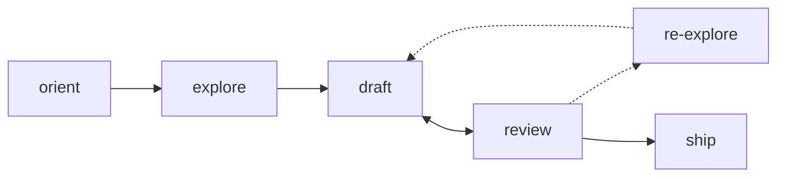

# WISE RPA BDD

Build **repeatable browser extraction suites** as executable `.robot` files.
The product is a **repeatable exploitation artifact**, not an exploration transcript.



**Key capabilities:** declarative BDD specs as executable rule DAGs, MDP-modeled
execution with guards and observation gates, write-ahead checkpoint/resume,
AOP aspect registry (timing, slow-motion, checkpoint), stealth browser adapter,
AI extraction pipeline, multi-resource chaining, and agent-generated suites
validated against golden baselines.

Use when: Robot Framework BDD syntax, repeatable browser extraction, pagination,
table capture, detail scraping, or generic browser-automation keywords are needed.

Do not use when: a stable API/export is clearly enough, or the user wants a
production browser runtime right now.

---

## 1 — Phases

| Phase | Verb | What happens | Output |
|-------|------|-------------|--------|
| orient | `/rrpa-orient` | Read this doc — understand harness, keywords, patterns | Mental model |
| explore | `/rrpa-explore` | Visit live site via `agent-browser`, test selectors | Confirmed selectors, DOM evidence |
| draft | `/rrpa-draft` | Write `.robot` suite grounded in evidence | `.robot` file |
| review | `/rrpa-review` | `robot --dryrun`, fix, loop back to draft | Clean dryrun |
| re-explore | `/rrpa-re-explore` | Verify uncertain selectors, check for popups | Revised evidence |
| ship | `/rrpa-ship` | Package suite + keyword library + docs | Ready-to-run layout |

### agent-browser quick reference

```bash
npx agent-browser open <url>          # navigate (persistent session)
npx agent-browser snapshot -c -d 3    # accessibility tree with CSS classes
npx agent-browser get count '<css>'   # count matching elements
npx agent-browser get text '<css>'    # get text content
npx agent-browser get html '<css>'    # get outer HTML
npx agent-browser eval '<js>'         # run JS expression
npx agent-browser click '<css>'       # click element
npx agent-browser close               # close browser session
```

Chain with `&&` — session persists between calls.

### Exploration-first rule

Before finalizing the suite, confirm: entry/auth behavior, record selectors,
pagination/expansion controls, parent-detail traversal, merge/dedupe keys,
and setup/state-check conditions. If you cannot justify a selector or merge
key from evidence, you are drafting too early.

---

## 2 — Non-Negotiables

1. Output only valid Robot Framework syntax.
2. All executable steps use `Given`, `When`, `Then`, `And`, or `But`.
3. Use the **generic keyword library** — never invent site-specific keyword names.
4. Site specifics go in variables, arguments, continuation rows, and locators.
5. Keep artifacts, resources, setup, chaining, emits, and quality gates explicit.
6. **Never use `When I wait`** — use observation gates instead (§ 6).
7. **Dismiss selectors must be surgical** — verify during explore (§ 6).

---

## 3 — Suite Format

Every suite follows this shape:

```robot
*** Settings ***
Documentation     Short summary
Library           Browser
Library           WiseRpaBDD
Suite Setup       Given I start deployment "${DEPLOYMENT}"
Suite Teardown    Then I finalize deployment

*** Variables ***
${DEPLOYMENT}     ...
${ARTIFACT_...}   ...
${ENTRY_...}      ...

*** Test Cases ***
Artifact Catalog          # artifact registrations + quality gates
Resource Name             # one test case per resource
```

### Structural mapping

| Concept | Robot BDD shape |
|---------|----------------|
| deployment | `${DEPLOYMENT}` variable |
| artifact | `Given I register artifact` in Artifact Catalog case |
| resource | one test case per resource |
| entry URL | `[Setup] Given I start resource "name" at "${ENTRY}"` |
| rule | `I define rule "name"` block |
| parent chain | `And I declare parents "a, b"` |
| state check | `Given url ...` / `And selector ... exists` |
| action | `When I click/type/hover/focus/press keys/...` |
| passthrough | `And I browser step ...` / `And I call keyword ...` |
| expansion | `When I expand ...` / `When I paginate ...` |
| extraction | `Then I extract fields` / `Then I extract table ...` |
| emit | `And I emit to artifact ...` |
| quality gate | `And I set quality gate ...` |

### Setup placement

- **Suite Setup** — deployment init (`Given I start deployment`)
- **Test Setup** (`[Setup]`) — per-resource entry navigation
- **Pure action rule** — deferred browser actions (login, auth) at walk time
- **`And I call keyword`** — defer a `*** Keywords ***` block with raw Browser calls

---

## 4 — Keyword Reference

`WiseRpaBDD` is a **generic** keyword library. All keywords are **deferred** —
they record during test case definition and execute during the rule walk when
the browser is live. Raw Browser library keywords (`Click`, `Fill Text`, etc.)
in test cases will crash — use deferred keywords, `And I browser step`, or
`And I call keyword` instead.

### 4.1 Deployment

| Keyword | Purpose |
|---------|---------|
| `Given I start deployment "${DEPLOYMENT}"` | Init extraction run (Suite Setup) |
| `Then I finalize deployment` | Execute rule tree, write outputs (Suite Teardown) |

### 4.2 Artifacts

**`Given I register artifact "${name}"`** — Declare data container.
Continuation rows: `field=<name> type=<string|number|url|array|html> required=<true|false>`

**`And I set artifact options for "${name}"`** — Options:
`output=`, `structure=<nested|flat>`, `dedupe=<field>`, `query=<jmespath>`,
`consumes=<artifact>`, `description=<text>`

### 4.3 Resources

| Keyword | Use |
|---------|-----|
| `Given I start resource "${name}" at "${url}"` | Static entry URL |
| `Given I start resource "${name}"` | No static URL (consume/resolve) |
| `Given I consume artifact "${name}"` | Input dependency |
| `Given I resolve entry from "${ref}"` | Entry URLs from another resource |
| `Given I iterate over parent records from "${case}"` | Loop over parent records |
| `And I set resource globals` | `timeout_ms=`, `retries=`, `page_load_delay_ms=`, `user_agent=` |

### 4.4 Rules

**`I define rule "${name}"`** — Named block within a resource. Body lines indented.

**`And I declare parents "${names}"`** — Parent rules (comma-separated).

### 4.5 State Checks

| Keyword | Purpose |
|---------|---------|
| `Given url contains "${pattern}"` | URL substring assertion |
| `Given url matches "${pattern}"` | URL regex assertion |
| `But url does not contain "${pattern}"` | Negative URL assertion |
| `And selector "${css}" exists` | Element existence assertion |
| `And table headers are "${headers}"` | Table headers (pipe-delimited) |

**Position determines type:** Before any action → **guard** (precondition,
skips rule on failure). After an action → **observation** (sync gate,
waits for async DOM). The engine routes automatically.

### 4.6 Actions — Navigation

| Keyword | Purpose |
|---------|---------|
| `When I open "${url}"` | Navigate to URL |
| `When I open the bound field "${field}"` | Navigate to URL from consumed/parent record |
| `When I add url params "${params}"` | Append query params and navigate |

### 4.7 Actions — Interaction

| Keyword | Options |
|---------|---------|
| `When I click locator "${css}"` | `await=<selector>` |
| `When I click text "${text}"` | `await=<selector>` |
| `When I double click locator "${css}"` | |
| `When I type "${value}" into locator "${css}"` | `await=<selector>` |
| `When I type secret "${value}" into locator "${css}"` | |
| `When I select "${value}" from locator "${css}"` | |
| `When I check locator "${css}"` | |
| `When I hover locator "${css}"` | |
| `When I focus locator "${css}"` | |
| `When I press keys "${css}"` | Keys as continuation args |
| `When I upload file "${path}" to locator "${css}"` | |
| `When I set stepper "${locator}" to ${count}` | Click increment N times |

### 4.8 Actions — Timing & Debug

| Keyword | Note |
|---------|------|
| `When I scroll down` | One viewport height |
| `When I wait for idle` | Network idle |
| `When I wait ${ms} ms` | Fixed — prefer `await=` or split rules |
| `When I take screenshot` | Optional: `filename=<path>` |

### 4.9 Expansion

**`When I expand over elements "${scope}"`** — Match elements, run child rules per element.
Options: `limit=<N>`, `exclude_if=<css>`

**`When I expand over elements "${scope}" with order "${order}"`** — `dfs` (default) or `bfs`.

**`When I paginate by next button "${css}" up to ${limit} pages`**

**`When I paginate by numeric control "${css}" from ${start} up to ${limit} pages`**

**`When I expand over combinations`** — Cartesian product of filter axes:
`action=<type|select|click> control=<css> values=<val1|val2|...|auto>`
Options: `exclude=<pat>`, `skip=<N>`, `emit=<artifact>`

When `values=auto`, the engine discovers values from the DOM. Empty strings
auto-excluded for `select` actions.

### 4.10 Extraction

**`Then I extract fields`** — From current page/element. Continuation rows:
`field=<name> extractor=<type> locator=<css>`
Extractors: `text`, `attr` (needs `attr=`), `link`, `html`, `image`, `grouped`, `number`

**`Then I extract table "${name}" from "${css}"`** — Header mapping:
`field=<name> header=<text>` / `header_row=<number>`

### 4.11 AI Extraction

**`Then I extract with AI "${name}"`** — Semantic extraction on captured text:
`prompt=<text>`, `input=<field>`, `schema=<json>`, `categories=<cat1|cat2|...>`

AI operates on previously extracted text — capture with `html`/`text` first,
reference via `input=`.

### 4.12 Emit / Merge / Output

| Keyword | Purpose |
|---------|---------|
| `And I emit to artifact "${name}"` | Push fields to artifact |
| `And I emit to artifact "${name}" flattened by "${field}"` | One record per array element |
| `And I merge into artifact "${name}" on key "${field}"` | Merge child into parent |
| `Then I write artifact "${name}" to "${path}"` | Write to specific path |

### 4.13 Quality Gates

| Keyword | Purpose |
|---------|---------|
| `And I set quality gate min records to ${count}` | Min record count |
| `And I set filled percentage for "${field}" to ${percent}` | Min field fill % |
| `And I set max failed percentage to ${percent}` | Max failure % |

### 4.14 Hooks, State Setup & Interrupts

**`And I register hook "${name}" at "${point}"`** — Points: `post_discover`,
`pre_extract`, `post_extract`, `pre_assemble`, `post_assemble`

**`Given I configure state setup`** — Pre-scrape auth:
`skip_when=<url>`, `action=open url=<url>`, `action=input css=<sel> value=<val>`,
`action=password css=<sel> value=<secret>`, `action=click css=<sel>`

**`And I configure interrupts`** — Auto-dismiss overlays: `dismiss=<css>`

### 4.15 Passthrough

**`And I browser step "${method}"`** — Defer a single Browser library method.

**`And I call keyword "${name}"`** — Defer any RF keyword (runs during walk
when browser is live).

### 4.16 Fallback Selectors

Pipe-delimited fallback chains — engine tries each, uses first match:

```robot
...    field=title    extractor=text    locator="h1.title | h1 | [data-field='title']"
```

### 4.17 `And I evaluate js "${script}"`

Escape hatch — defer JS to run on the live page. Supports async scripts.
Use only when no declarative keyword exists.

```robot
And I evaluate js "() => { document.querySelector('#btn').click(); }"
And I evaluate js "async () => { await navigateCalendar('November 2026'); }"
```

**Keyword preference order:**
1. Deferred BDD keywords (`When I click locator`, `When I type`, etc.)
2. `And I call keyword` (multi-step RF flows)
3. `And I evaluate js` (escape hatch)
4. `And I browser step` (raw adapter method)

---

## 5 — Starter Template

```robot
*** Settings ***
Documentation     Minimal strict BDD suite
Library           Browser
Library           WiseRpaBDD
Suite Setup       Given I start deployment "${DEPLOYMENT}"
Suite Teardown    Then I finalize deployment

*** Variables ***
${DEPLOYMENT}        example-deployment
${ENTRY_URL}         https://example.com
${ARTIFACT_RECORDS}  records

*** Test Cases ***
Artifact Catalog
    Given I register artifact "${ARTIFACT_RECORDS}"
    ...    field=title    type=string    required=true
    ...    field=url      type=url       required=true
    And I set artifact options for "${ARTIFACT_RECORDS}"
    ...    output=true

Primary Resource
    [Setup]    Given I start resource "primary" at "${ENTRY_URL}"
    I define rule "root"
        Given url contains "/"
        And selector ".row" exists
        When I expand over elements ".row"
        Then I extract fields
        ...    field=title    extractor=text    locator=".title"
        ...    field=url      extractor=link    locator="a"
        And I emit to artifact "${ARTIFACT_RECORDS}"

Quality Gates
    And I set quality gate min records to 10
    And I set filled percentage for "title" to 95
```

---

## 6 — Patterns

### 6.1 Pagination + element extraction

```robot
Resource Quotes
    [Setup]    Given I start resource "quotes" at "${ENTRY_URL}"
    I define rule "pages"
        When I paginate by next button ".next a" up to 5 pages
    I define rule "items"
        And I declare parents "pages"
        When I expand over elements ".quote"
        Then I extract fields
        ...    field=text      extractor=text    locator=".text"
        ...    field=author    extractor=text    locator=".author"
        And I emit to artifact "${ARTIFACT}"
```

### 6.2 Sort + table extraction

```robot
    I define rule "sort_action"
        When I click locator "th.durability a"
        Given url contains "durability"
    I define rule "table_data"
        And I declare parents "sort_action"
        Then I extract table "stats" from "table"
        ...    field=team    header=Team Name
        ...    field=dur     header=Durability
        And I emit to artifact "${ARTIFACT}"
```

### 6.3 Discovery → detail chaining (multi-resource)

```robot
Discovery Resource
    [Setup]    Given I start resource "discover" at "${ENTRY_URL}"
    When I expand over elements "nav a" with order "bfs"
    Then I extract fields
    ...    field=page_url    extractor=link    locator="."
    And I emit to artifact "${ARTIFACT_URLS}"

Detail Resource
    [Setup]    Given I start resource "detail"
    Given I consume artifact "${ARTIFACT_URLS}"
    When I open the bound field "page_url"
    Then I extract fields
    ...    field=title    extractor=text    locator="h1"
    ...    field=body     extractor=html    locator="article"
    And I emit to artifact "${ARTIFACT_PAGES}"
```

### 6.4 Variant / combination matrix

```robot
    I define rule "variants"
        And I declare parents "products"
        When I expand over combinations
        ...    action=click    control="button.swatch"    values=auto    emit=options
        Then I extract fields
        ...    field=size     extractor=text    locator=".selected"
        ...    field=price    extractor=text    locator=".price"
        And I emit to artifact "${ARTIFACT_VARIANTS}"
```

### 6.5 Auth flow (pure action rule)

```robot
Resource protected_content
    [Setup]    Given I start resource "content" at "${LOGIN_URL}"
    I define rule "login"
        When I type "${USERNAME}" into locator "#username"
        When I type secret "${PASSWORD}" into locator "#password"
        When I click locator "#submit"
        When I wait for idle
    I define rule "scrape"
        And I declare parents "login"
        When I expand over elements ".result"
        Then I extract fields
        ...    field=title    extractor=text    locator="h1"
        And I emit to artifact "${ARTIFACT}"
```

### 6.6 Complex setup via call keyword

```robot
*** Keywords ***
Accept Terms And Login
    Click    #accept-terms
    Fill Text    #email    ${EMAIL}
    Fill Text    #password    ${PASSWORD}
    Click    #login-submit

*** Test Cases ***
Resource dashboard
    [Setup]    Given I start resource "dashboard" at "${ENTRY_URL}"
    I define rule "auth"
        And I call keyword "Accept Terms And Login"
    I define rule "data"
        And I declare parents "auth"
        When I expand over elements ".widget"
        Then I extract fields
        ...    field=metric    extractor=text    locator=".value"
        And I emit to artifact "${ARTIFACT}"
```

### 6.7 AI extraction (when CSS isn't enough)

```robot
    Then I extract fields
    ...    field=body    extractor=html    locator="article"
    Then I extract with AI "classify"
    ...    input=body
    ...    categories=tutorial|reference|api|changelog
```

### 6.8 Observation gates (async dependencies)

**Never use `When I wait`.** Every wait hides a missing observation. Use one
of three patterns:

**Option A — Split rules** (named state transitions):

```robot
I define rule "type_city"
    When I type "${CITY}" into locator "#search-input"
I define rule "autocomplete_ready"
    And I declare parents "type_city"
    And selector "[data-testid='option-0']" exists
I define rule "select_city"
    And I declare parents "autocomplete_ready"
    When I click locator "[data-testid='option-0']"
```

Use when the observation is a meaningful milestone worth naming.

**Option B — `await=` inline gate** (keeps rules grouped):

```robot
I define rule "enter_city"
    When I type "${CITY}" into locator "#search-input"
    ...    await=[data-testid='option-0']
    When I click locator "[data-testid='option-0']"
```

Use for low-level async dependencies within one user intent. Works on
`When I click locator`, `When I type`, `When I click text`. Supports
fallback selectors (`await=.opt-0 | .option:first-child`).

**Option C — Interleaved state check** (observation between actions):

```robot
I define rule "fill_form"
    When I type "admin" into locator "#username"
    And selector "#password" exists
    When I type "secret" into locator "#password"
```

```
Pick which?
  Is the observation a meaningful milestone worth naming?
  ├── Yes → Split rules (Option A)
  └── No → Low-level async within one intent?
      ├── Yes → await= (Option B)
      └── No → Interleaved state check (Option C)
```

### 6.9 Dismiss scoping (interrupt handling)

Auto-dismiss overlays via `And I configure interrupts` with `dismiss=<css>`.
Interrupts fire before every action and state check.

**Critical rule:** dismiss selectors must NOT match interactive panels the
flow depends on (search bars, calendars, guest pickers).

| Good | Bad |
|------|-----|
| `text="Got it"` | `[role="dialog"] button` (matches any dialog) |
| `[data-testid="cookie-banner"] button` | `button[aria-label="Close"]` (too broad) |
| `.promo-overlay .dismiss` | `[data-testid="modal-container"] button` |

During explore, test each dismiss selector **with interactive panels open**
to verify it doesn't close them.

### 6.10 Dropdown with placeholder skip

```robot
    When I expand over combinations
    ...    action=select    control="#size-dropdown"    values=auto    skip=1    exclude=N/A
```

---

## 7 — Validation

Two gates — run both before shipping:

```bash
# 1. BDD structure check
python scripts/validate_suite.py path/to/suite.robot

# 2. Keyword resolution check
python -m robot --dryrun --output NONE --log NONE --report NONE \
  --pythonpath scripts path/to/suite.robot
```

Loop `/rrpa-draft` ↔ `/rrpa-review` until both pass clean.

---

## 8 — Agent Contract

1. Start in `/rrpa-orient`, not `/rrpa-draft`.
2. Use `/rrpa-explore` before committing to selectors. No guessing.
3. `/rrpa-draft` and `/rrpa-review` loop until dryrun passes clean.
4. Prefer shipped keywords and the WiseRpaBDD library.
5. Extend the library only with new **generic** capabilities.
6. `/rrpa-ship` delivers a self-contained package.
7. AI may propose selectors, draft suites, author AI extraction prompts.
   AI must not replace generic keywords with site-specific verbs.

### AI role

Bad: `When I open the Revspin durability page`
Good: `When I click locator "td.durability a"`

---

## 9 — Authoring Shape

Treat the Robot suite as the public exploitation spec:

| Concept | Shape |
|---------|-------|
| Deployment | suite variables + setup/teardown |
| Artifact | named registration + emit/merge/write |
| Resource | one test case per data source |
| Background | Suite Setup, Test Setup, or reusable generic keywords |
| Rule block | named steps inside a resource case |
| Parent-child chaining | explicit parent iteration or artifact consumption |

Avoid collapsing the flow into one opaque keyword.

### Async dependencies — what to look for during explore

| Action | What to observe | Example |
|--------|----------------|---------|
| Type into search | Autocomplete appears | `[data-testid='option-0']` |
| Click to open panel | Panel content loads | Stepper button appears |
| Click submit | Page navigates, results load | URL changes + cards appear |
| Click pagination | Content swaps via AJAX | First card text changes |

Record each as a pair: triggering action + completion selector. These become
observation gates in the draft.

---

## 10 — Reference Files

| File | Purpose |
|------|---------|
| `docs/robotframework-guide.html` | Robot Framework language reference |
| `tests/golden/*.robot` | Vetted golden baselines for regression |
