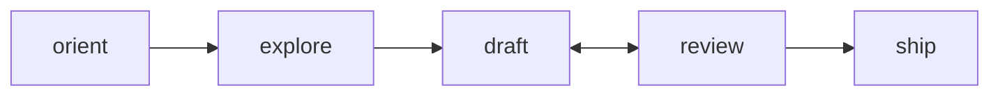

# Workflow

Read this after `SKILL.md`. This is the operating model for the skill.

## Big Picture

You are building a **repeatable exploitation suite** for a browser task. The shipped pieces fit together like this:



| Phase | What happens | Output |
|-------|-------------|--------|
| **orient** | Read workflow, keyword contract, templates | Understanding of harness |
| **explore** | Visit live site via Playwright/agent-browser, test selectors | Confirmed selectors, DOM evidence |
| **draft** | Write .robot suite using WiseRpaBDD keywords | .robot file grounded in evidence |
| **review** | Run `robot --dryrun`, fix issues, loop back to draft | Clean dryrun pass |
| **ship** | Package suite + keyword library + docs | Ready-to-run project layout |

Use the mode verbs from `SKILL.md` while you work:

- `/rrpa-orient`
- `/rrpa-explore`
- `/rrpa-draft`
- `/rrpa-review`
- `/rrpa-ship`

**Task brief** — what the user wants extracted or automated.

**Browser exploration** — inspect the live site, test selectors, confirm state transitions, pagination, login, and detail traversal.

**Evidence** — the facts you gathered: selectors that worked, DOM structure, visible state markers, extracted sample rows, merge keys, pagination controls.

**`.robot` suite** — the repeatable exploitation artifact. This is the public spec and the reusable deliverable.

**BDD validator** — ensures the suite stays in strict BDD form and uses the generic harness correctly.

**`robot --dryrun`** — ensures the suite is executable against the shipped keyword library.

## Decisions You Need To Make

1. **Can the shipped keyword contract express the flow?**
2. **What belongs in suite setup, test setup, and resource cases?**
3. **What artifacts must be declared for repeatability and chaining?**
4. **What evidence proves the chosen selectors and transitions?**
5. **Does the task fit the shipped harness, or does the harness need a generic extension?**

## What To Read When

| Step | Read |
|---|---|
| Orient | `references/workflow.md` |
| Draft suite shape | `references/format.md` |
| Choose step vocabulary | `references/keyword-contract.md` |
| Model resources/artifacts | `references/flow-shape.md` |
| Run validation | `references/harness.md` |

## Exploration-First Rule

Do not guess the exploitation suite from the task prompt alone when the target is live and interactive.

Before finalizing the suite, confirm:

- page entry and auth behavior
- the selectors or locators for the records you need
- pagination or expansion controls
- parent/detail traversal points
- the fields needed for merge or dedupe
- any conditions that belong in setup or state checks

## Evidence Standard

Evidence can be:

- selector checks
- DOM snippets
- browser eval results
- page-state notes
- sample extracted rows
- screenshots or snapshots if needed

The suite should be explainable from the evidence. If you cannot justify a selector or a merge key, you are drafting too early.

## Async Dependencies — What to Look For During Explore

Interactive sites have actions that trigger async DOM changes. During explore, identify these explicitly:

| Action | What to observe | Example |
|--------|----------------|---------|
| Type into search | Autocomplete/dropdown appears | `[data-testid='option-0']` after typing city |
| Click to open panel | Panel content loads | Stepper button appears after "Add guests" |
| Click submit | Page navigates, results load | URL changes + card elements appear |
| Click pagination | Content swaps via AJAX | First card text changes |
| Click calendar forward | Heading re-renders | Month heading text changes |

**Record each async dependency as a pair**: the action that triggers it and the selector that signals completion. These become observation gates in the draft.

### Guard vs Observation — Position Determines Type

State checks in a rule have two roles, determined entirely by **position**:

- **Before any action** → **Guard** (Type 1 precondition). "Is the world in the state I expect?" If it fails, the rule is skipped (or aborted if `guard_policy=abort`).
- **After an action** → **Observation** (Type 2 gate). "Has the side effect landed?" Required for correctness in async DOM.

```
I define rule "search"
    Given url contains "airbnb.com"       # ← Guard (before actions)
    And selector "#search-input" exists   # ← Guard (still before actions)
    When I type "Miami" into locator "#search-input"   # ← First action
    And selector "[data-testid='option-0']" exists      # ← Observation (after an action)
    When I click locator "[data-testid='option-0']"     # ← Action
```

The engine routes these automatically via `_add_state_check`. You don't annotate them — just place them correctly.

### Observation Gate Decision Tree

Three patterns — pick based on intent:

```
Is the observation a meaningful milestone worth naming?
├── Yes → Split rules
└── No → Is it a low-level async dependency within one user intent?
    ├── Yes → await= (inline)
    └── No → Interleaved state check (observation between actions)
```

**1. Split rules** (named state transitions):
```
action rule → state-gate rule (And selector "..." exists) → next action rule
```
Use when the observation is a meaningful milestone worth naming ("search results loaded", "autocomplete ready"). Each rule can have its own retry and guard policy.

**2. `await=`** (inline, within a rule):
```
When I type "${CITY}" into locator "#input"
...    await=[data-testid='option-0']
When I click locator "[data-testid='option-0']"
```
Use when the observation is a low-level async dependency within a single user intent. Minimal overhead, no new rule needed.

**3. Interleaved state check** (observation gate between actions):
```
I define rule "fill_form"
    When I type "admin" into locator "#username"
    And selector "#password" exists        # ← observation gate
    When I type "secret" into locator "#password"
```
Use when you need to verify DOM state between actions but don't need the full `await=` syntax.

**Never use `When I wait`**. Every wait is a bug — it hides a missing observation.

### Dismiss Selector Scoping

During explore, identify popups/overlays that appear intermittently (cookie banners, pricing modals, promo overlays). For each, find the **most specific** dismiss selector.

**Critical rule**: dismiss selectors must NOT match interactive panels that the flow depends on. On Airbnb, `[role="dialog"] button[aria-label="Close"]` matches the search panel, calendar, and guest picker — clicking it destroys the flow.

| Good | Bad |
|------|-----|
| `text="Got it"` (specific text) | `[role="dialog"] button` (matches any dialog) |
| `[data-testid="cookie-banner"] button` | `button[aria-label="Close"]` (too broad) |
| `.promo-overlay .dismiss` | `[data-testid="modal-container"] button` (matches search panel) |

During explore, test each dismiss selector against the page **while the search/form panels are open** to verify it doesn't close them.

## Repeatable Exploitation

The suite is good only when another agent can:

1. read the task brief,
2. inspect the suite,
3. understand the artifacts/resources/setup,
4. run the validation harness,
5. and continue refining or executing from there.

That is the main product of the skill.
