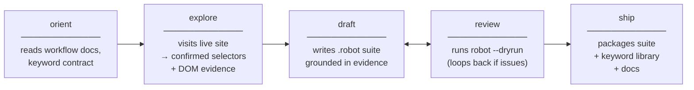

# Workflow

Read this after `SKILL.md`. This is the operating model for the skill.

## Big Picture

You are building a **repeatable exploitation suite** for a browser task. The shipped pieces fit together like this:

Use the mode verbs from `SKILL.md` while you work:

- `/rrpa-orient`
- `/rrpa-explore`
- `/rrpa-draft`
- `/rrpa-review`
- `/rrpa-ship`

**Task brief** — what the user wants extracted or automated.

**Browser exploration** — inspect the live site, test selectors, confirm state transitions, pagination, login, and detail traversal.

**Evidence** — the facts you gathered: selectors that worked, DOM structure, visible state markers, extracted sample rows, merge keys, pagination controls.

**`.robot` suite** — the repeatable exploitation artifact. This is the public spec and the reusable deliverable.

**BDD validator** — ensures the suite stays in strict BDD form and uses the generic harness correctly.

**`robot --dryrun`** — ensures the suite is executable against the shipped keyword library.

## Decisions You Need To Make

1. **Can the shipped keyword contract express the flow?**
2. **What belongs in suite setup, test setup, and resource cases?**
3. **What artifacts must be declared for repeatability and chaining?**
4. **What evidence proves the chosen selectors and transitions?**
5. **Does the task fit the shipped harness, or does the harness need a generic extension?**

## What To Read When

| Step | Read |
|---|---|
| Orient | `references/workflow.md` |
| Draft suite shape | `references/format.md` |
| Choose step vocabulary | `references/keyword-contract.md` |
| Model resources/artifacts | `references/flow-shape.md` |
| Run validation | `references/harness.md` |

## Exploration-First Rule

Do not guess the exploitation suite from the task prompt alone when the target is live and interactive.

Before finalizing the suite, confirm:

- page entry and auth behavior
- the selectors or locators for the records you need
- pagination or expansion controls
- parent/detail traversal points
- the fields needed for merge or dedupe
- any conditions that belong in setup or state checks

## Evidence Standard

Evidence can be:

- selector checks
- DOM snippets
- browser eval results
- page-state notes
- sample extracted rows
- screenshots or snapshots if needed

The suite should be explainable from the evidence. If you cannot justify a selector or a merge key, you are drafting too early.

## Repeatable Exploitation

The suite is good only when another agent can:

1. read the task brief,
2. inspect the suite,
3. understand the artifacts/resources/setup,
4. run the validation harness,
5. and continue refining or executing from there.

That is the main product of the skill.
